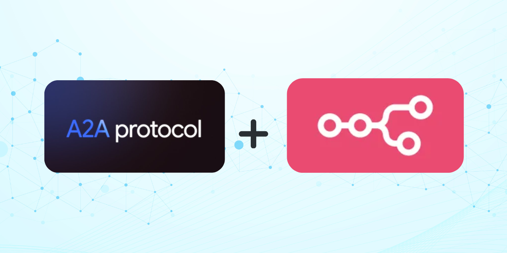

# n8n-nodes-agent2agent

This is an n8n community node. It lets you use **Google's Agent2Agent (A2A) protocol** in your n8n workflows.

**Google's Agent2Agent (A2A) protocol** is an open standard designed to enable communication, secure information exchange, and task coordination between different AI agents, regardless of their underlying framework or vendor. This node allows your n8n workflows to act as an A2A client, interacting seamlessly with any A2A-compatible agent.

[n8n](https://n8n.io/) is a [fair-code licensed](https://docs.n8n.io/reference/license/) workflow automation platform. This node helps you integrate the power of distributed AI agents directly into your automation pipelines.

[Installation](#installation)  
[Operations](#operations)  
[Credentials](#credentials)  
[Compatibility](#compatibility)  
[Usage](#usage)  
[Development Prerequisites](#development-prerequisites)  
[Resources](#resources)  
[Version history](#version-history)

## Installation

Follow the [installation guide](https://docs.n8n.io/integrations/community-nodes/installation/) in the n8n community nodes documentation to install this community node. You will need to use the npm package name: `n8n-nodes-agent2agent`.

## Operations

This node package provides the following operations to interact with A2A agents:

- **`Discover Agent`**: Fetches and parses an agent's public "Agent Card" (typically found at `/.well-known/agent.json`). This retrieves essential metadata about the target agent, including its description, endpoint URL, communication capabilities (like streaming support), and required authentication methods. The output can be used to configure subsequent node operations dynamically.
- **`Send Task`**: The primary operation to interact with an agent.
  - Initiates a _new task_ by sending an initial message.
  - Sends a _follow-up message_ to an existing task (if a Task ID is provided).
  - Supports sending various content types through `Message Parts`:
    - `TextPart`: For plain text messages or instructions.
    - `FilePart`: For sending binary data (from previous nodes or via URI) with a specified MIME type.
    - `DataPart`: For sending structured JSON data.
  - Includes an option (`Wait for Completion`) to configure whether the node waits for the task to reach a final state (`completed`, `failed`, `canceled`) or returns immediately after submission. When waiting, the node handles polling or streaming (if supported by the agent and implemented in the node) to get the final result.
  - Outputs the resulting A2A Task object, with `artifacts` parsed into accessible n8n data formats (text, JSON, binary).
- **`Get Task`**: Retrieves the current status, message history, and generated artifacts for a specific Task ID that was previously submitted to an agent. Useful for checking the progress or outcome of long-running tasks initiated with `Send Task (Wait for Completion = false)`.
- **`Cancel Task`**: Sends a request to the target A2A agent to cancel an ongoing task associated with a specific Task ID.

## Credentials

Authentication is handled by the target A2A agent, not the A2A protocol itself. Therefore, the specific credentials required will depend entirely on the agent you are interacting with.

1.  **Identify Requirements:** Use the `Discover Agent` operation or consult the target agent's documentation to determine the authentication schemes it supports (e.g., API Key in header, Bearer Token, OAuth2, JWT). This information is typically found in the `authentication` section of the Agent Card.
2.  **Configure n8n Credential:** This node package provides generic credential types to handle common A2A authentication methods. Set up a new credential in n8n under Settings -> Credentials -> New:
    - Select the appropriate `Agent2Agent` credential type (e.g., `A2A API Key`, `A2A Bearer Token`, `A2A OAuth2`). _\[Note: These credential types must be defined within this node package.]_
    - Fill in the required details (API Key value, Bearer Token, OAuth2 Client ID/Secret/Scopes, etc.) based on the target agent's requirements.
    - Give the credential a memorable name.
3.  **Select in Node:** Choose the configured credential from the 'Credentials' dropdown in the node's parameter settings when performing operations like `Send Task`.

Always ensure you are securely managing the credentials required by the specific agents you interact with.

## Compatibility

- **Minimum n8n Version:** This node is developed and tested against n8n version `1.x.x`. It may work with older versions, but compatibility is not guaranteed. Please ensure your n8n instance is reasonably up-to-date.
- **Tested Versions:** Regularly tested against the latest stable n8n release.
- **Known Issues:** Currently, no known version incompatibility issues. Please report any issues encountered on the GitHub repository.

## Usage

This node allows you to integrate external AI agents into your n8n workflows using the standardized A2A protocol.

**Core Concept:** Your n8n workflow acts as an **A2A Client**. You use the node operations to send requests (tasks) to an external **A2A Agent Server** and process its responses (artifacts).

**Example High-Level Workflow:**

1.  **Trigger:** Start your workflow (e.g., Webhook, Schedule).
2.  **Prepare Data:** Use standard n8n nodes to gather and format the information you need to send to the agent.
3.  **(`Optional`) Discover Agent:** Use the `Discover Agent` operation with the agent's base URL to check its capabilities and authentication needs.
4.  **Send Task:** Use the `Send Task` operation:
    - Provide the Agent URL (discovered or known).
    - Select your configured Credentials.
    - Define the `Message Parts` containing your request (text, data from previous steps, files).
    - Choose whether to `Wait for Completion`. If unsure, or for long tasks, set it to `false` initially.
5.  **(`If Wait=false`) Poll/Check Status:** If you didn't wait, you might use `Get Task` in a loop (with a Wait node) or a separate workflow to check the task status until it's final, using the `Task ID` returned by `Send Task`.
6.  **Process Results:** Once the task is complete (either via `Send Task (Wait=true)` or `Get Task`), access the agent's response from the node's output. The `artifacts` will be parsed into usable data (JSON, text, binary) for use in subsequent n8n nodes (e.g., update a database, send a notification, call another API).

**Important Considerations:**

- **Agent Capabilities:** Not all A2A agents are equal. Always check the specific agent's documentation or Agent Card (`Discover Agent` operation) to understand:
  - What `skills` it actually offers.
  - What input `parts` (text, file, data) it expects for a given skill.
  - What `artifacts` it produces.
  - Whether it supports advanced features like `streaming`.
- **Error Handling:** Implement error handling in your workflow. The A2A node will output error details if the agent returns an error response or if the request fails for other reasons.

Need help with n8n basics? Check out the [Try it out](https://docs.n8n.io/try-it-out/) documentation.

## Development Prerequisites

If you wish to contribute to the development of this node or run it locally from source, you need the following installed on your development machine:

- [git](https://git-scm.com/downloads)
- Node.js and pnpm. Minimum version Node 18. You can find instructions on how to install both using nvm (Node Version Manager) for Linux, Mac, and WSL [here](https://github.com/nvm-sh/nvm). For Windows users, refer to Microsoft's guide to [Install NodeJS on Windows](https://docs.microsoft.com/en-us/windows/dev-environment/javascript/nodejs-on-windows).
- Install n8n globally with:
  ```bash
  pnpm install n8n -g
  ```
- Recommended: follow n8n's guide to [set up your development environment](https://docs.n8n.io/integrations/creating-nodes/build/node-development-environment/).

After cloning the repository, run `pnpm i` to install local dependencies. Use `pnpm lint` and `pnpm build` while developing. Refer to n8n's [node creation documentation](https://docs.n8n.io/integrations/creating-nodes/) for more details.

## Resources

- **Official A2A Protocol Resources:**
  - [Google A2A GitHub Repository (Specification, Samples)](https://github.com/google/A2A)
  - [Google A2A Documentation Site](https://google.github.io/A2A/)
  - [Google Developers Blog Post (Announcement & Overview)](https://developers.googleblog.com/en/a2a-a-new-era-of-agent-interoperability/)
- **n8n Documentation:**
  - [n8n Community Nodes Documentation](https://docs.n8n.io/integrations/community-nodes/)
  - [n8n Node Creation Documentation](https://docs.n8n.io/integrations/creating-nodes/)

## Version history

- **`0.1.0`:**
  - Initial release.
  - Includes `Discover Agent`, `Send Task`, `Get Task`, and `Cancel Task` operations.
  - Supports basic credential types (e.g., API Key/Bearer Token via Header - _actual types depend on implementation_).
  - `Send Task` includes `Wait for Completion` option (using polling). Basic parsing of text, data, and file artifacts.

_(Add new versions here as the node evolves)_

---

License: MIT _(Ensure LICENSE.md file is present and updated)_
